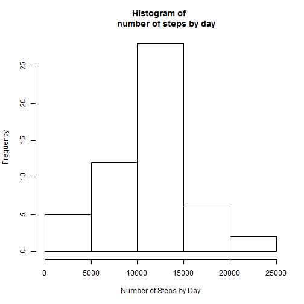
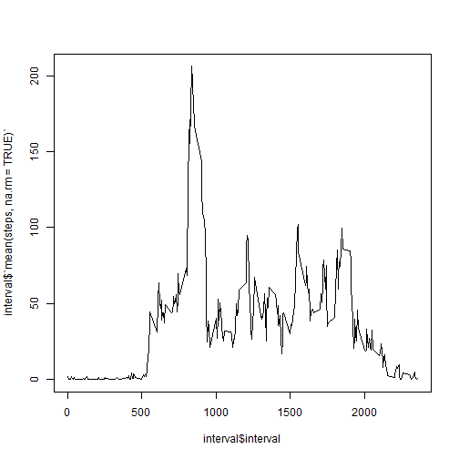
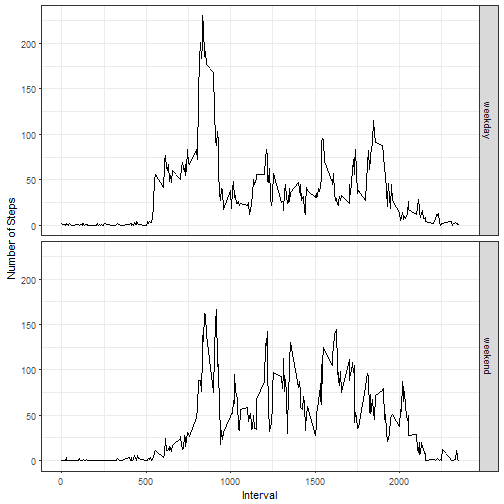

## Loading and preprocessing the data

```r
library(lubridate)
library(dplyr)
library(ggplot2)
act <- read.csv("activity.csv", header=TRUE)
act$date <- ymd(act$date)
```


## What is mean total number of steps taken per day?

```r
dailyact <- act %>% group_by(date) %>% summarise(sum(steps))
hist(dailyact$`sum(steps)`, xlab="Number of Steps by Day", main="Histogram of 
     number of steps by day")
```



```r
cat("Mean daily steps: ", mean(dailyact$`sum(steps)`, na.rm=TRUE), "\n")
```

```
## Mean daily steps:  10766.19
```

```r
cat("Median daily steps: ", median(dailyact$`sum(steps)`, na.rm=TRUE))
```

```
## Median daily steps:  10765
```


## What is the average daily activity pattern?

```r
interval <- act %>% group_by(interval) %>% summarise(mean(steps, na.rm=TRUE))
plot(interval$interval, interval$`mean(steps, na.rm = TRUE)`, type="l")
```



```r
interval$interval[which.max(interval$`mean(steps, na.rm = TRUE)`)] 
```

```
## [1] 835
```


## Imputing missing values

```r
cat("Total number of missing values: ", sum(is.na(act$steps)))
```

```
## Total number of missing values:  2304
```

```r
# Use average steps during that 5-min to impute values
act_new <- act
ind <- which(is.na(act_new$steps)==TRUE)
for(i in 1:length(ind)){
  act_new$steps[ind[i]] <- interval$`mean(steps, na.rm = TRUE)`[which(interval$interval==act_new$interval[ind[i]])]
}
# Compute new mean and median steps per day
dailyact_new <- act_new %>% group_by(date) %>% summarise(sum(steps))
hist(dailyact_new$`sum(steps)`, xlab="Number of Steps by Day", main="Histogram of
     number of steps by day")
```


```r
cat("Mean daily steps: ", mean(dailyact_new$`sum(steps)`), "\n")
```

```
## Mean daily steps:  10766.19
```

```r
cat("Median daily steps: ", median(dailyact_new$`sum(steps)`))
```

```
## Median daily steps:  10766.19
```


## Are there differences in activity patterns between weekdays and weekends?

```r
#Create new weekday factor
act_new$dayow <- "weekday"
act_new$dayow[which((weekdays(act_new$date)=="Saturday") | (weekdays(act_new$date)=="Sunday"))] <- "weekend"
#group by weekday and weekend and average the steps
comp <- act_new %>% group_by(interval, dayow) %>% summarise(mean(steps))
colnames(comp)[3] <- "steps"
#plot
ggplot(comp, aes(x=interval, y=steps))+
  geom_line()+
  facet_grid(dayow~.)+
  xlab("Interval")+
  ylab("Number of Steps")+
  theme_bw()
```



